<div align="center">
  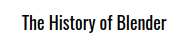
</div>
<div align="center">
  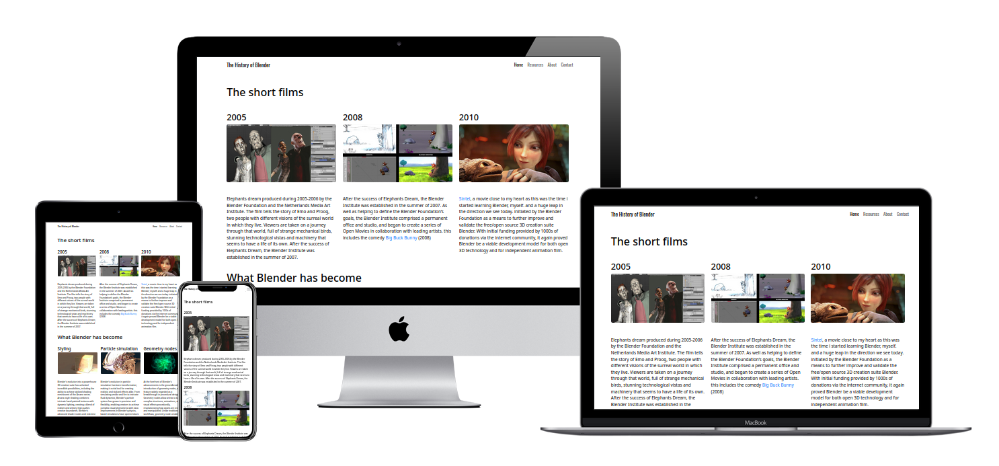
</div>

[The History of Blender](https://theblep.github.io/the-history-of-blender/index.html) is designed as an approachable introduction to Blender's history, offering users a brief yet engaging journey through its evolution. The goal is to provide digestible insights into Blender's past and present, while also sharing resources for those eager to dive deeper into learning. With a friendly, conversational tone, the site feels like a passionate friend sharing their enthusiasm for Blender. Its minimal and focused design keeps the content from feeling overwhelming, emphasizing key milestones and the vibrant community that surrounds Blender 3D.

## Table of Contents
1. <details open>
    <summary><a href="#ux">UX</a></summary>

    <ul>
    <li><details>
    <summary><a href="#goals">Goals</a></summary>

    - [Visitor Goals](#visitor-goals)
    - [Business Goals](#business-goals)
    - [User Stories](#user-stories)
    </details></li>

    <li><details>
    <summary><a href="#visual-design">Visual Design</a></summary>

    - [Wireframes](#wireframes)
    - [Fonts](#fonts)
    - [Icons](#icons)
    - [Colors](#colors)
    - [Images](#images)
    - [Styling](#styling)
    </details></li>
    </ul>
</details>

2. <details open>
    <summary><a href="#features">Features</a></summary>

    <ul>
    <li><details>
    <summary><a href="#page-elements">Page Elements</a></summary>

    - [All Pages](#all-pages)
    - [Index Page](#index-page)
    - [Gallery Page](#gallery-page)
    - [Contact Page](#contact-page)
    </details></li>

    <li><details>
    <summary><a href="#additional-features">Additional Features</a></summary>

    - [Image Loading Blur](#image-loading-blur)
    - [Email](#email)
    </details></li>

    <li><details>
    <summary><a href="#feature-ideas">Feature Ideas</a></summary>

    - [Basic](#basic)
    - [Content](#content)
    </details></li>
    </ul>
</details>

3. <details open>
    <summary><a href="#technologies-used">Technologies Used</a></summary>

    - [Languages](#languages)
    - [Frameworks](#frameworks)
    - [Libraries](#libraries)
    - [APIs](#apis)
    - [Platforms](#platforms)
    - [Other Tools](#other-tools)
</details>

4. <details open>
    <summary><a href="#testing">Testing</a></summary>

    <ul>
    <li><details>
    <summary><a href="#methods">Methods</a></summary>

    - [Validation](#validation)
    - [General Testing](#general-testing)
    - [Mobile Testing](#mobile-testing)
    - [Desktop Testing](#desktop-testing)
    </details></li>

    <li><details>
    <summary><a href="#bugs">Bugs</a></summary>

    - [Known Bugs](#known-bugs)
    - [Fixed Bugs](#fixed-bugs)
    </details></li>
    </ul>
</details>

5. <details open>
    <summary><a href="#deployment">Deployment</a></summary>

    <ul>
    <li><details>
    <summary><a href="#local-deployment">Local Deployment</a></summary>

    - [Local Preparation](#local-preparation)
    - [Local Instructions](#local-instructions)
    </details></li>

    <li><details>
    <summary><a href="#github-deployment">Github Deployment</a></summary>

    - [Github Preparation](#github-preparation)
    - [Github Instructions](#github-instructions)
    </details></li>
    </ul>
</details>

6. <details open>
    <summary><a href="#credit-and-contact">Credit and Contact</a></summary>

    - [Content](#content)
    - [Contact](#contact)
</details>

----

# UX
## Goals
### Visitor Goals

The target audience for "The History of Blender" website includes:

- People interested in the history and evolution of Blender.
- Beginners curious about Blender's origins before starting to learn it.
- Blender enthusiasts seeking additional resources for further education.
- Fans of open-source software and its impact on creative tools.
- Individuals who enjoy blog-style storytelling about technical topics.

User goals are:

- Gain an understanding of Blender's history in a concise, engaging way.
- Discover key milestones in Blender's development.
- Explore additional resources for learning more about Blender.
- Enjoy a friendly, blog-style tone that feels welcoming and approachable.
- Navigate a clean and minimal site without being overwhelmed by information.

The History of Blender" fulfills these needs by:

- Introducing users to the site with a clear and friendly tone.
- Highlighting Blender's past and present through a timeline.
- Providing links to resources for further exploration, such as tutorials or documentation.
- Keeping the design minimal and focused, ensuring the information remains digestible.
- Offering a layout that feels personal, akin to a passionate storyteller sharing their knowledge.


### Business Goals

The Business Goals of "The History of Blender" website are:
- Provide informative content on Blender's history in an engaging and accessible way.
- Attract a wider audience interested in learning about Blender’s evolution.
- Offer resources that help users get started with Blender.
- Potential future revenue from ads displayed on the website.
- Consider the possibility of selling a plugin or resource that simplifies Blender's introduction for beginners.


### User Stories

1. As a user interested in learning about Blender, I expect to see a clear and engaging presentation of Blender's history.
2. I expect the information to be presented in a way that's easy to follow and entertaining.
3. As a beginner in Blender, I expect to find resources that help me understand its evolution and significance.
4. As a user interested in the development of open-source tools, I expect to see detailed information about Blender's impact.
5. As a user interested in the community behind Blender, I expect to learn about its contributors and their influence on the software.
6. I expect to be able to explore additional resources that can help me dive deeper into Blender's features and capabilities.
7. As a potential customer, I would like to know about any products, such as a plugin, that could help me get started with Blender.
8. If I were interested in ads or related offers, I expect them to be relevant to my interests in Blender.


## Visual Design
### Frameworks
Templates for HTML framework were made using Chat GPT and edited apon with Bootstrap and code snippets from the course.

### Fonts
<div align="center">
  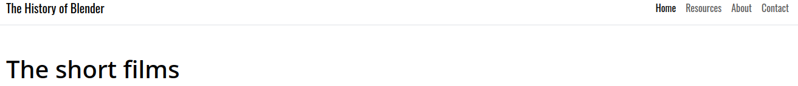
</div>

- The primary font, [Oswald](https://fonts.google.com/specimen/Oswald) was chosen because it seemed to fit well with the minimal look of the website.
- The secondary font, serif was chosen due to its default nature in HTML as well as to simplify the development.

### Icons
<div align="center">
  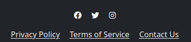
</div>

- Icons are taken from the [Fontawesome](https://fontawesome.com/) Icon library and are utilised with the "fab fa-..." classes
- Icons are utilised in the footer for social account icons.

### Colors
<div align="center">
  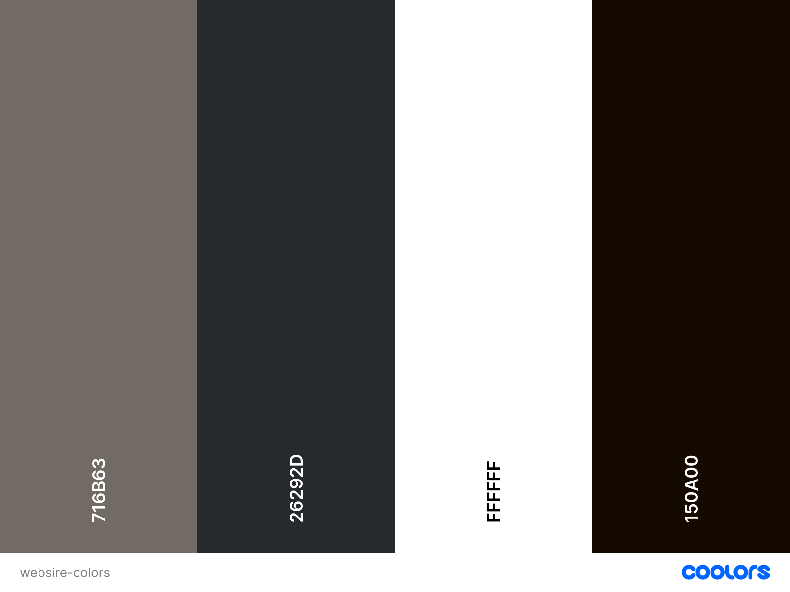
</div>

- The site is designed with a minimal aesthetic, ensuring the content remains the focus without distractions.
- White is the primary color, providing a clean backdrop that enhances readability and directs attention to the information.
- A light accent color, chosen for subtle warmth, is used sparingly to highlight key sections and guide the user’s eye.
- Text is presented in black or dark grey for clear contrast against the light background, making the content easy to read.
- A neutral grey color is used for the footer, helping to visually separate it from the main content and maintain a clean layout.


### Images
<div align="center">
  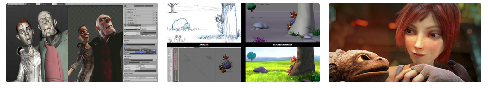
  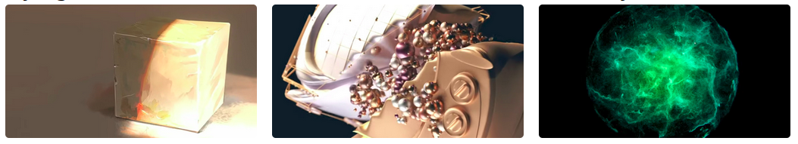
</div>

- The site has a large focus on images, showcasing the evolution of visuals developed in Blender.
- On the home page the images are displayed in three columns responsively, so they can easily be seen on any size device.
- The images and respective text will automatically space themselves vertically within the column, so the column is never too thin.

### Styling
- For this project I have utilised Bootstrap 5.3 CSS and JS libraries to ease development on the navigation bar, buttons, contact form and content responsivness.
- The primary and secondary colors have been applied to bootstrap classes for easy use across the site.

----

# Features
## Page Elements
### All Pages
#### Navbar
<div align="center">
  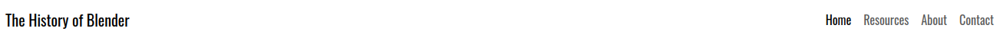
  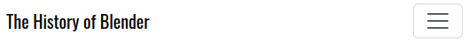
</div>

- The Navbar is simple, providing only two major options and one contact option.
- The Logo is always isolated and easy to read, adapting to smaller screens.
- On smaller devices, the menu becomes collapsible.
- The mobile nav button has been placed to the right for ease of use with one hand.

#### Footer
<div align="center">
  
</div>

- Located at the bottom of every page, highlighting the (non existant) privacy policy and terms of service additionally to the contact page.
- Made of three columns, changing shape for larger or smaller devices.

### Index Page
#### Short films
<div align="center">
  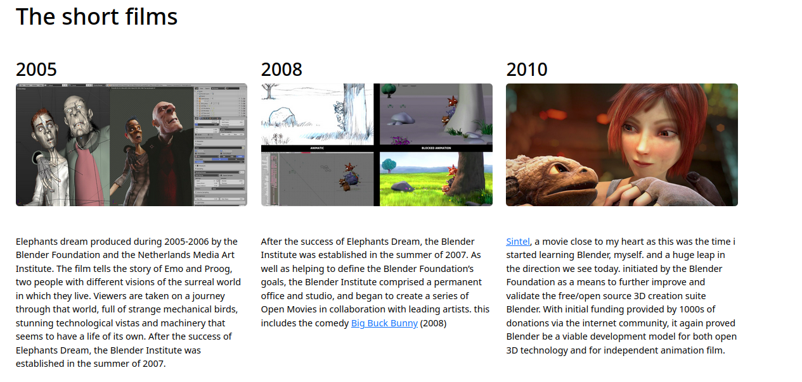
</div>

- Minimal and direct approach with information on the first official short films of the Blender institute.
- Three columns are used with images first to intice the user to continue further and read the text. 
- Text contains a links to further reading or the short film itself.

#### What Blender has become
<div align="center">
  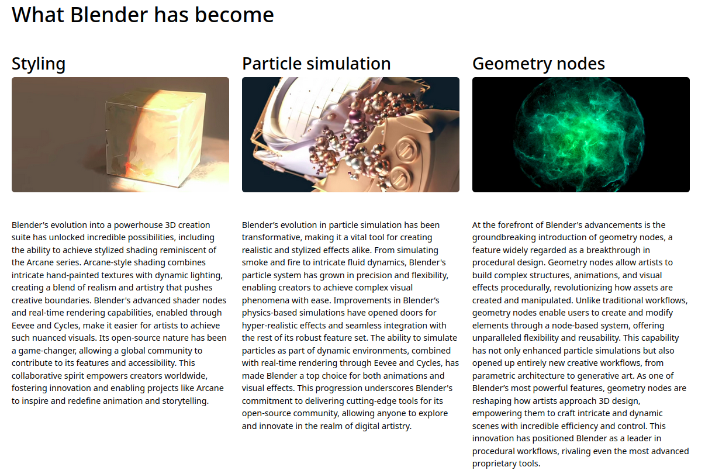
</div>

- After the initial image to give a foundation, the "What Blender has become" section presents the contrasting modern status and visuals of Blender
- Hopefully, the impact will create enough interest to read the further text and/or proceed to the resources page.
- The section is responsive and the three columns will stack on resize.

### Resource Page
<div align="center">
  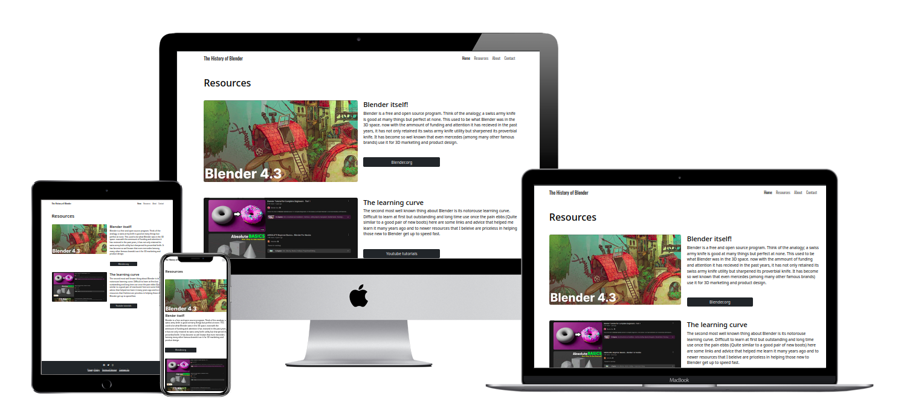
</div>

- Matching the minimal style of the index page, the resource page contains two rows each with two columns, one image, one text with link.
- The first row gives a link directly to the Blender home page and further information.
- The second link sends the user to a few tutorials perfect for beginners wanting to start learning Blender.

### Contact Page
<div align="center">
  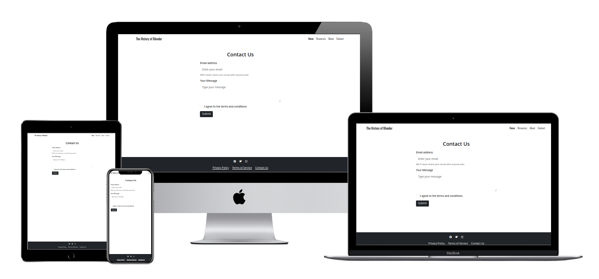
</div>

- A simple page highlighting the contact form that utilises the bootstrap contact form, sending the information to a confirmation page highlighting the information sent.
- There is an unused "Success page" that could be implemented.
- Once the send button is pressed, the Code Institute verification page will open, notifying the user what data was sent.
- Any fields not correctly filled out will yeild an error message, notifying the user of the missing information and preventing submission.

## Feature Ideas
- Content!
- Contact page could have more info on it regarding why you would want to contact the author.
- The about page could be better structured and contane a more fluid explaination.
- The story telling could be improved with a clear line to follow
- Gifs could be inserted instead of images ot more clearly create an impact with things that require movmetn to digest, such as particle simulations and dynamic geometry nodes.
-Resources could be more compact and varied to allow more directions for further reading.

# Technologies Used
## Languages
- [HTML](w3.org/standards/webdesign/htmlcss)
    * Page markup.
- [CSS](w3.org/standards/webdesign/htmlcss)
    * Styling.

## Frameworks
- [Bootstrap4](https://getbootstrap.com/)
    * Basic styles and outline.

## Libraries
- [Google Fonts](https://fonts.google.com)
    * Font Styles.
- [Fontawesome](https://fontawesome.com/)
    * For icons


## Platforms
- [Github](https://github.com/)
    * Storing code remotely and deployment.
- [Gitpod](https://gitpod.io/)
    * IDE for project development.

## Other Tools
- [Mockup Generator](http://techsini.com/multi-mockup/)
    * For device mockup images.
- [Coolors](https://coolors.co/)
    * Creating color pallettes.

----

# Testing
## Methods
### Validation
- HTML has been validated with [W3C HTML5 Validator](https://validator.w3.org/). No errors
- CSS has been validated with [W3C CSS Validator](https://jigsaw.w3.org/css-validator/) No errors
- Accessabilit validated with [Pagespeed](pagespeed.web.dev) 100% accessabiltiy on all pages

### General Testing
- Each time a feature was added, all the functions were tested to see if there was an impact.
- All forms have validation and will not submit without the proper information.
- External links open in a new tab.

### Mobile and Desktop Testing
- I tested the site personally on my Android device, going through the entire process, checking buttons, functions, checking out, etc. I was personally unable to test on iOS.
- The site was developed on Linux, Firefox.
- Testing on Chrome, Edge and Firefox on Windows and Linux systems has shown full functionality.
- Internet Explorer was not tested.

## Bugs
### Known Bugs
- On mobile devices perfomance decreases to ~80% compared to the near 100% on desktop devices
- Content and the visual redline is lacking and could be improved.
- Storyline could be made more clear.

### Fixed Bugs
- Burger menu on smaller devices would dissapear and/or not expand. Fixed by removing conflicting CSS styles and adding missing quotation marks in tag classes.
- Contact form would not send data. Fixed by adding name class to the form tag.
- Parsing error on google fonts import. Fixed by removing previously unseen comment end tag at the end of import.


----

# Deployment
## Local Deployment
### Local Preparation
**Requirements:**
- An IDE of your choice, such as [Gitpod](https://www.gitpod.io/)

### Local Instructions
1. Clone the repository with:
    ```
    git clone https://github.com/TheBlep/the-history-of-blender
    ```
    To disconnect it from the master repository, use:
    ```
    git remote rm origin
    ```
2. Open your IDE and choose the base directory.
3. Run the project with your chosen method. You can drop index.html into a web browser and it should run fine, open a local port and access it or, if you have python installed, run it on an HTTP server with python with a command such as:
    ```
    python3 -m http.server
    ```
4. Enjoy the site!

## Github Deployment
### Github Preparation
- It is possible to copy or clone the repository directly for deployment.
**Requirements:**
- A free GitHub account.

### Github Instructions
1. Log in to your GitHub account.
navigate to [https://github.com/TheBlep/the-history-of-blender](https://github.com/TheBlep/the-history-of-blender).
1. You can set up your own repository and copy or clone it, or you fork the repository.
2. `git add`, `git commit` and `git push` to a GitHub repository, if necessary.
3. GitHub pages will update from the master branch by default.
4. Go to the **Settings** page of the repository.
5. Scroll down to the **Github Pages** section.
7. Select the Master Branch as the source and **Confirm** the selection.
8. Wait a minute or two and it should be live for viewing. See my own [here](https://theblep.github.io/the-history-of-blender/index.html).

## Credits and Contact
### Content
Much of the text content was generated by the AI, GPT-4, including the boilder plate for the html.
The blender.org [History page](https://www.blender.org/about/history/) was the main source for information as well as my personal knowledge of Blender.
Any code utilised from a site is documented and credited within the code.
[Bootstrap](https://getbootstrap.com/) is heavly relied apon for the navbar, footer, contact page, buttons and styling.
All photographs are screen shots from the Blender website or YouTube. The mockup images where made using a free online tool.
The README is based heavly on the template from [https://github.com/Ri-Dearg/horizon-photo/blob/main/README.md](https://github.com/Ri-Dearg/horizon-photo/blob/main/README.md)

### Contact
Please feel free to contact me via github.